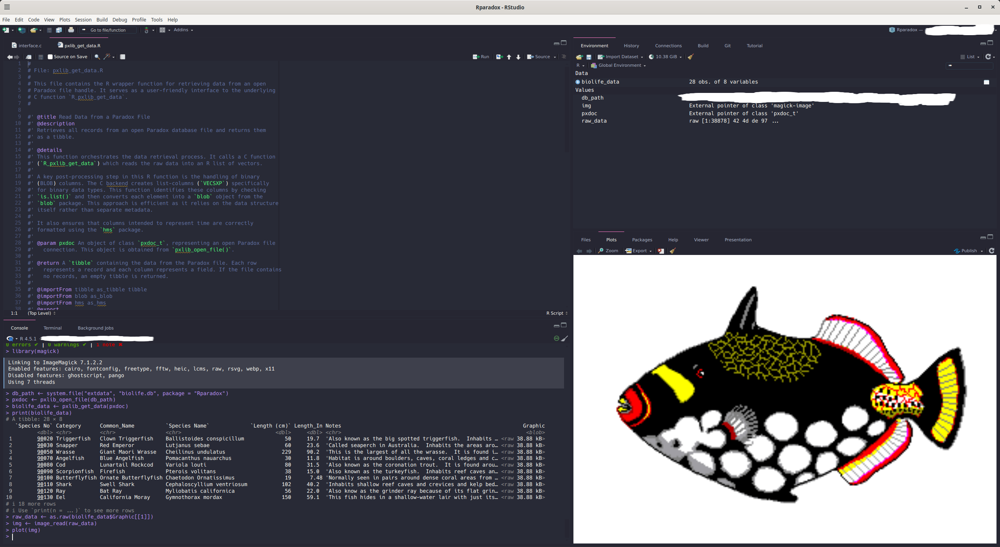

[](https://deepwiki.com/celebithil/Rparadox)

# Rparadox: A Modern Interface for Reading Paradox Databases in R

**Rparadox** provides a simple and efficient way to read data from
Paradox database files (`.db`) directly into R as modern `tibble` data
frames. It uses the underlying `pxlib` C library to handle the low-level
file format details and provides a clean, user-friendly R interface.

This package is designed to “just work” for the most common use case:
extracting the full dataset from a Paradox table, including its
associated BLOB/memo file (`.mb`).

------------------------------------------------------------------------

## Features

- **Direct Reading:** Reads Paradox `.db` files without needing database
  drivers or external software.
- **Tibble Output:** Returns data in the `tibble` format, which is fully
  compatible with the Tidyverse ecosystem.
- **Automatic BLOB Handling:** Automatically detects, attaches, and
  reads data from associated memo/BLOB (`.mb`) files.
- **Character Encoding Control:** Automatically handles character
  encoding conversion to UTF-8 and allows the user to manually override
  the source encoding for files with incorrect headers.
- **Type Conversion:** Correctly maps Paradox data types to their
  corresponding R types, including `Date`, `Time` (`hms`), `Timestamp`
  (`POSIXct`), `Logical`, `Integer`, `Numeric`, and binary `blob`
  objects.

------------------------------------------------------------------------

## Installation

You can install the development version of Rparadox from GitHub using
the `devtools` package.

``` r
# install.packages("devtools")
devtools::install_github("celebithil/Rparadox")
```

------------------------------------------------------------------------

## Usage

Using the package involves two main functions: `pxlib_open_file()` to
open a connection to the database and `pxlib_get_data()` to read the
data. The connection is then closed with `pxlib_close_file()`.

### Basic Example

This example reads a simple Paradox file included with the package. The
code below is executed live when this README is generated, ensuring the
output is always accurate.

``` r
# 1. Load the package
library(Rparadox)

# 2. Get the path to an example database
db_path <- system.file("extdata", "biolife.db", package = "Rparadox")

# 3. Open the file
# This automatically finds and attaches the 'biolife.mb' BLOB file.
pxdoc <- pxlib_open_file(db_path)

# 4. Read the data into a tibble
if (!is.null(pxdoc)) {
  biolife_data <- pxlib_get_data(pxdoc)

  # 5. Always close the file when you're done
  pxlib_close_file(pxdoc)
  
  # 6. View the data
  print(biolife_data)
}
#> # A tibble: 28 × 8
#>    `Species No` Category      Common_Name `Species Name` `Length (cm)` Length_In
#>           <dbl> <chr>         <chr>       <chr>                  <dbl>     <dbl>
#>  1        90020 Triggerfish   Clown Trig… Ballistoides …            50     19.7 
#>  2        90030 Snapper       Red Emperor Lutjanus sebae            60     23.6 
#>  3        90050 Wrasse        Giant Maor… Cheilinus und…           229     90.2 
#>  4        90070 Angelfish     Blue Angel… Pomacanthus n…            30     11.8 
#>  5        90080 Cod           Lunartail … Variola louti             80     31.5 
#>  6        90090 Scorpionfish  Firefish    Pterois volit…            38     15.0 
#>  7        90100 Butterflyfish Ornate But… Chaetodon Orn…            19      7.48
#>  8        90110 Shark         Swell Shark Cephaloscylli…           102     40.2 
#>  9        90120 Ray           Bat Ray     Myliobatis ca…            56     22.0 
#> 10        90130 Eel           California… Gymnothorax m…           150     59.1 
#> # ℹ 18 more rows
#> # ℹ 2 more variables: Notes <chr>, Graphic <blob>
```

<figure>

<figcaption aria-hidden="true">biolife.db</figcaption>
</figure>

### Handling Incorrect Character Encoding

If you have a legacy file where the encoding is specified incorrectly in
the header (e.g., it says ASCII but is actually CP866), you can manually
override it using the `encoding` parameter.

``` r
# This tells the package to interpret the source data as CP866
pxdoc <- pxlib_open_file("path/to/your/file.db", encoding = "cp866")

# The rest of the process is the same
data <- pxlib_get_data(pxdoc)
pxlib_close_file(pxdoc)
```

This ensures that all text fields are correctly converted to UTF-8 in
the final `tibble`.
